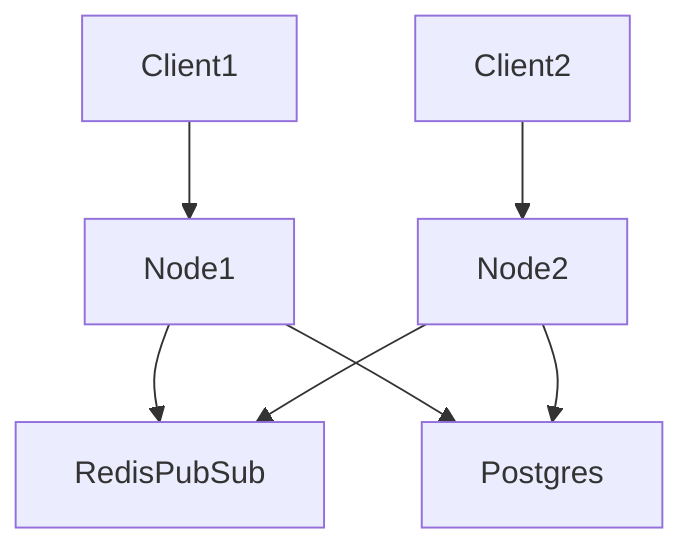

# realtimechatapp

A multi-room real-time chat application with horizontal scaling support.

This application provides multi-room WebSocket communication via Socket.io. It persists chat history using PostgreSQL and utilizes a Redis Pub/Sub adapter to allow scaling across multiple Node.js instances.

### Tech
Node.js, Express, Socket.io, PostgreSQL, Redis

### Architecture


### Getting started
```bash
npm install
npm start
```